```mermaid
graph TD
    A[🎯 Microservices Architecture] --> B[Java Spring Boot]
    A --> C[Docker Containers]
    A --> D[Kubernetes Orchestration]
    
    E[☁️ Cloud Infrastructure] --> F[AWS Services]
    E --> G[Terraform IaC]
    E --> H[Auto-scaling Solutions]
    
    I[🚀 Frontend Excellence] --> J[React Ecosystem]
    I --> K[TypeScript]
    I --> L[Responsive Design]
    
    M[⚡ DevOps Pipeline] --> N[CI/CD Automation]
    M --> O[Monitoring & Observability]
    M --> P[Infrastructure as Code]
    
    style A fill:#00D9FF,stroke:#333,stroke-width:2px,color:#000
    style E fill:#FF6B35,stroke:#333,stroke-width:2px,color:#000
    style I fill:#4CAF50,stroke:#333,stroke-width:2px,color:#000
    style M fill:#FFD43B,stroke:#333,stroke-width:2px,color:#000
```

# <div align="center">🚀 Kaique Augusto</div>

<div align="center">
  
</div>

<div align="center">
  
</div>

##  **Sobre Mim**


```typescript
const kaique = {
  role: "Software Engineer",
  location: "São Paulo, Brazil 🇧🇷",
  focus: ["Cloud Architecture", "Microservices", "DevOps"],
  currentlyLearning: ["AI/ML Integration", "Advanced K8s", "Serverless"],
  askMeAbout: ["Java", "React", "AWS", "Docker", "Kubernetes"],
  funFact: "I debug in production and sleep peacefully 😎"
};
```

---

##  **Tech Arsenal**

<div align="center">

### 🎯 **Core Technologies**
<div style="display: flex; flex-wrap: wrap; justify-content: center; gap: 10px; margin: 20px 0;">


</div>

### ☁️ **Cloud & Infrastructure**
<div style="display: flex; flex-wrap: wrap; justify-content: center; gap: 10px; margin: 20px 0;">


</div>

### 🛠️ **DevOps & Tools**
<div style="display: flex; flex-wrap: wrap; justify-content: center; gap: 10px; margin: 20px 0;">


</div>

</div>

---

##  **GitHub Analytics**

<div align="center">
  
  
</div>

<div align="center">
  
</div>

---

##  **Experience Highlights**

<div align="center">



</div>

---

##  **Architecture Philosophy**

<div align="center">

| **Principle** | **Implementation** | **Result** |
|:---:|:---:|:---:|
| 🔄 **Scalability** | Microservices + K8s | `99.9%` Uptime |
| ⚡ **Performance** | Optimized Algorithms | `<100ms` Response Time |
| 🛡️ **Security** | Zero Trust Architecture | `SOC 2` Compliance |
| 🚀 **Innovation** | CI/CD + Testing | `Daily` Deployments |

</div>

---

##  **Current Focus**

<div align="center">
  
```yaml
2024_Goals:
  learning:
    - "Advanced Kubernetes (CKA Certification) 🎯"
    - "AWS Solutions Architect Professional 🏗️"
    - "Machine Learning with Python 🤖"
    - "Serverless Architecture Patterns ⚡"
  
  building:
    - "Multi-cloud Migration Strategy 🌐"
    - "Real-time Data Processing Pipeline 📊"
    - "AI-powered Code Review System 🧠"
  
  contributing:
    - "Open Source Projects 🌟"
    - "Tech Community Events 🎤"
    - "Mentoring Developers 👥"
```

</div>

---

##  **Let's Connect!**

<div align="center">

[](https://www.linkedin.com/in/kaiquezeza)
[](mailto:kaiquezeza@gmail.com)
[](https://portfolio-kz-v2.vercel.app/)

</div>

<div align="center">
  
</div>

---

<div align="center">
  
  
  **💡 "Code is poetry written in logic, deployed with passion!"**
  
  
</div>
